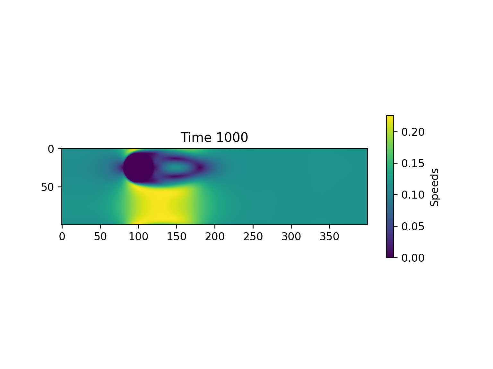

Lattice - Boltzmann method

with reference to https://www.youtube.com/watch?v=JFWqCQHg-Hs

microscopic particles that make up a fluid can be discribed with a distribution function $f(\mathbf{x},\mathbf{v})$ --> phase-space density of fluids 

Bhatnagar–Gross–Krook (BGK) approximation is used here to describe stream (LHS) and collision (RHS), with $\tau$ being the timescale when collisions happen and $f$ tends towards some equillibrium state $f^{eq}$:
$$(\partial_t + \mathbf{w} \cdot \mathbf{{\nabla}}  )f = -\frac{f - f^{eq}}{\tau}$$ 

Discretising onto the lattice leads to:

$$
F_i(\mathbf{x_i} + \mathbf{v_i}\Delta t) - F_i(\mathbf{x_i},t) = -\frac{F_i(\mathbf{x_i},t) - F_i^{eq}(\mathbf{x_i},t)}{\tau}
$$

where $i$ is one of the 9 lattice directions

Interestingly, moments of $f$ could be taken to recover fluid variables at each lattice sites, e.g. 

- Density: $ \rho = \sum_i{F_i}$
- momentum: $\rho \mathbf{u} = \sum_i{F_i\mathbf{v}_i}$

For collisions

Calculating $F^{eq}$, which depends on fluid model's equation of state

for an isothermal fluid --> const sound speed --> lattice speed $c = 1$; soundspeed $^2 = 1/3$

$$
F_i^{eq} = w_i\rho  \left( 1 + 3(\mathbf{v}_i \cdot \mathbf{u}) + \frac{9}{2}(\mathbf{v}_i \cdot \mathbf{u})^2 - \frac{3}{2}(\mathbf{u} \cdot \mathbf{u})^2\right)
$$

c.f. Novier-Stokes equation with a dynamic viscosity

$$
\mu = \rho(\tau - \frac{1}{2})\Delta t
$$

## Results
#### Fluid speed after 1000 timesteps

#### Fluid vortices (curl) after 1000 timesteps
 after 1000 timesteps")

## To execute
In the terminal, go to the current directory
