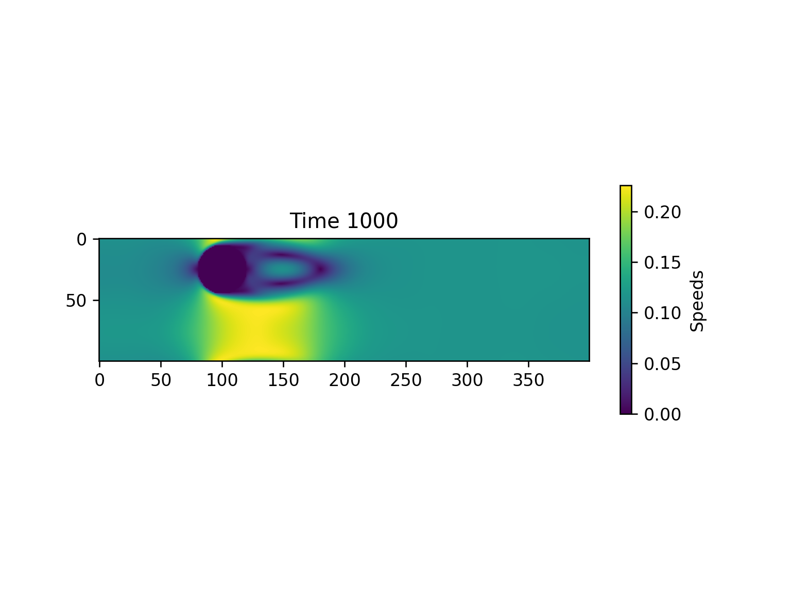

# HPC-Kickstart

### Fluid Dynamics using Jacobi Method of a top-in right-out 2D box 
- simulation parallelised using Numba
- Simulation results:

    

### Fluid Dynamics in a box with a cylindrical obstacle using Lattice Boltzmann method 
- Plotted speed and vortices simulation results after some time period
- Real time simulation can be run in `\CFD\Lattice-Boltzmann\main.py` (go to the file directory in terminal and execute)
- Simulation results for speed:

      

- Simulation results for vortices:

    

